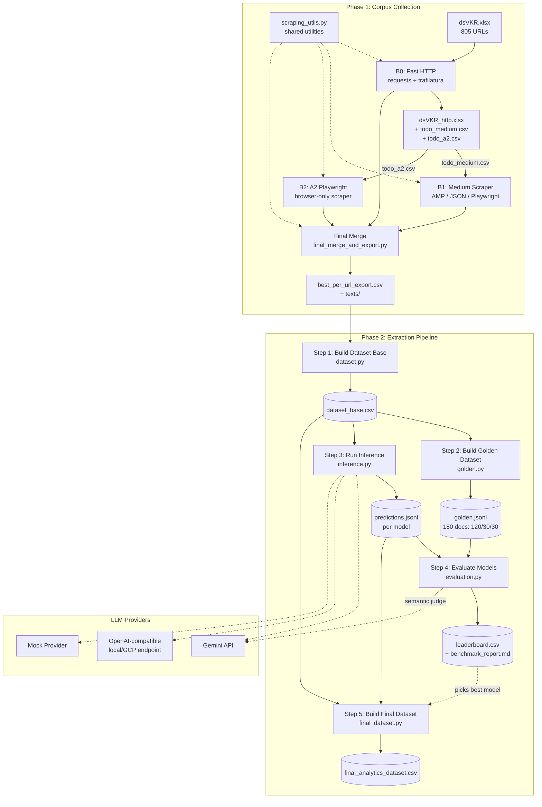

# Architecture

## System overview

The project builds a structured dataset of **enterprise AI-maturity signals** extracted from web articles. It consists of two sequential phases:

1. **Corpus Collection** — scrape ~800 URLs, extract clean article text, merge into a single export.
2. **LLM Extraction & Evaluation** — feed texts to LLM models, extract structured JSON payloads with AI-adoption signals, evaluate quality against a golden dataset, produce a final analytics table.

The end goal is `final_analytics_dataset.csv` — every article annotated with maturity level (0-4), signal fields, confidence, and evidence spans.

## Component diagram



## Data flow

### Phase 1: Corpus Collection

```
dsVKR.xlsx (805 rows, column "Link")
  │
  ├─► B0_make_dsVKR_http.py
  │     Input: dsVKR.xlsx + bucket_a.jsonl (pre-fetched HTTP results)
  │     Filters by quality: word_count >= 300, text_len >= 1000
  │     Output: dsVKR_http.xlsx (matched rows)
  │             todo_medium.csv (Medium-like URLs not yet scraped)
  │             todo_a2.csv (remaining URLs needing browser)
  │
  ├─► B1_medium.py
  │     Input: todo_medium.csv
  │     Strategy: try AMP format → try JSON format → Playwright fallback
  │     Output: medium.jsonl + text_store/ + medium_errors.csv
  │
  ├─► B2_a2_playwright.py
  │     Input: todo_a2.csv
  │     Strategy: Playwright with overlay dismissal, scroll, DOM extraction
  │              Optional trafilatura fallback on weak DOM text
  │     Output: a2_playwright.jsonl + text_store/ + a2_errors.csv
  │
  └─► final_merge_and_export.py
        Merges all three sources
        Picks best text per url_canonical (by quality score + source rank)
        Exports: best_per_url_export.csv + texts/*.txt
```

### Phase 2: Extraction Pipeline

```
best_per_url_export.csv + texts/
  │
  ├─► 01_build_dataset_base.py
  │     Reads CSV + text files, filters good=True, deduplicates by url_canonical
  │     Assigns doc_id (DOC000001..N)
  │     Output: artifacts/data/dataset_base.csv, .jsonl, _report.json
  │
  ├─► 02_build_golden_dataset.py
  │     Stratified sampling: 180 docs from dataset_base
  │     Strata: industry x year x text_len quartile
  │     Split: 120 train / 30 dev / 30 test
  │     Output: artifacts/golden/golden.csv, .jsonl, per-split files, QA sample
  │
  ├─► 03_run_inference.py
  │     For each configured model: build prompt → call LLM → parse JSON → normalize
  │     Output per model: artifacts/inference_runs/<RUN_ID>/<model>/predictions.jsonl, .csv
  │
  ├─► 04_evaluate_models.py
  │     Compares predictions against golden test split
  │     Strict metrics: status accuracy, deployment exact, multilabel F1,
  │                     maturity accuracy, weighted kappa, evidence span overlap
  │     Semantic metrics (optional): LLM-as-judge (groundedness, completeness, hallucination)
  │     Final score = 0.70 * strict + 0.30 * semantic
  │     Output: artifacts/evaluation/leaderboard.csv, benchmark_report.md
  │
  └─► 05_build_final_dataset.py
        Picks best model from leaderboard (or explicit alias)
        Merges dataset_base + model predictions
        Flattens nested payload into columns
        Output: artifacts/final/final_analytics_dataset.csv, .jsonl
```

## Key design decisions

### Join key: `url_canonical`

All pipeline stages join on `url_canonical` — a URL with fragments and tracking parameters (`utm_*`, `gclid`, etc.) stripped. This resolves the 805 → 801 unique document problem in the original dataset.

**Why:** The original `dsVKR.xlsx` contains 4 duplicate URLs that differ only in tracking parameters. Using raw URLs would create mismatches between scraping outputs and the dataset.

### Three-bucket scraping strategy

URLs are processed in priority order: HTTP-only (fast, cheap) → Medium-specific (AMP/JSON before browser) → general Playwright. Each subsequent bucket only processes URLs that the previous one couldn't resolve.

**Why:** Minimizes browser automation (slow, fragile) by solving the easy cases first. Medium articles have specific API endpoints (AMP, JSON format) that are faster and more reliable than full browser rendering.

### Shared scraping utilities (`scripts/scraping_utils.py`)

All scraping scripts import common functions from a single shared module: URL canonicalization, JSONL/CSV I/O, Playwright helpers (`try_close_overlays`, `scroll_page`, `extract_dom_text`), and the `ExtractResult` dataclass. Domain-specific logic (Medium paywall detection, YouTube filtering, login-wall heuristics) stays in individual scripts.

**Why:** Eliminates code duplication across 5 scripts (~250 lines of previously copy-pasted utilities) while keeping domain-specific behavior local.

### Immutable dataset_base

Step 1 creates a frozen snapshot of the corpus. Downstream steps never modify it — they only read and produce new artifacts.

**Why:** Ensures reproducibility. If scraping is re-run, only Step 1 needs re-running. Golden annotations and inference results reference stable `doc_id` values.

### Stratified golden sampling

The 180-document golden set is stratified by `industry x year x text_len_quartile` to ensure representativeness. The test split (30 docs) is locked with `golden_test_locked_ids.txt`.

**Why:** Prevents evaluation leakage and ensures the benchmark covers the corpus diversity.

### Provider abstraction

Models are configured via JSON registry, not code changes. Three provider types:
- `GeminiProvider` — Google Generative AI API
- `OpenAICompatibleProvider` — any OpenAI-compatible endpoint (local LLMs, GCP)
- `MockProvider` — deterministic keyword-based baseline (no API needed)

**Why:** Allows benchmarking multiple models in a single run without code changes. Mock provider enables pipeline testing without credentials.

### Dual evaluation: strict + semantic

- **Strict score** (70%): status accuracy, deployment exact match, multilabel macro-F1, maturity accuracy, weighted kappa, evidence span overlap.
- **Semantic score** (30%): LLM-as-judge evaluating groundedness, completeness, hallucination risk.

The strict score is a weighted blend with fixed component weights (0.15 + 0.10 + 0.30 + 0.20 + 0.15 + 0.10 = 1.0).

**Why:** Strict metrics catch factual errors but miss nuance (e.g., "ML pipeline" vs "machine learning pipeline"). Semantic judge captures meaning equivalence but is expensive and nondeterministic.

### Extraction schema with evidence spans

Each extraction payload includes `evidence_spans` — short quotes from the source text with optional character offsets. Span overlap is part of the evaluation.

**Why:** Evidence grounding reduces hallucination and makes the dataset auditable. Character offsets enable precise attribution when available.

## Extraction schema (prompt contract)

```json
{
  "ai_use_cases":       {"status": "present|absent|uncertain", "items": ["..."]},
  "adoption_patterns":  {"status": "...", "items": ["..."]},
  "ai_stack":           {"status": "...", "items": ["..."]},
  "kpi_signals":        {"status": "...", "items": ["..."]},
  "budget_signals":     {"status": "...", "items": ["..."]},
  "org_change_signals": {"status": "...", "items": ["..."]},
  "risk_signals":       {"status": "...", "items": ["..."]},
  "roadmap_signals":    {"status": "...", "items": ["..."]},
  "deployment_scope":   {"status": "...", "value": "..."},
  "maturity_level":     0,
  "maturity_rationale": "...",
  "confidence":         0.0,
  "evidence_spans":     [{"field": "...", "quote": "...", "start_char": null, "end_char": null}]
}
```

8 list signal fields + 1 scalar field + maturity level (0-4) + confidence (0-1) + evidence spans.

## API / interfaces between modules

### pipeline_core public functions

| Module | Function | Input | Output |
|---|---|---|---|
| `dataset.py` | `build_dataset_base(input_csv, output_csv, output_jsonl, report_path)` | CSV from scraping export | dataset_base files + report dict |
| `golden.py` | `build_golden_dataset(dataset_base_csv, output_dir, ...)` | dataset_base.csv | golden files + report dict |
| `inference.py` | `run_inference(dataset_base_csv, model_registry_path, output_dir, ...)` | dataset_base.csv + model_registry.json | predictions per model + run summary |
| `evaluation.py` | `evaluate_run(golden_jsonl, inference_run_dir, output_dir, ...)` | golden.jsonl + inference predictions | leaderboard + benchmark report |
| `final_dataset.py` | `build_final_dataset(dataset_base_csv, inference_run_dir, output_csv, ...)` | dataset_base + predictions | final_analytics_dataset files |
| `providers.py` | `load_model_registry(path)` → `build_provider(config)` → `provider.generate(system, user, settings)` | JSON registry file | `ProviderResponse(content, latency_ms, token_usage, raw_response)` |
| `schema.py` | `normalize_extraction_payload(raw)` | dict or JSON string | `(normalized_payload, errors)` |
| `prompting.py` | `build_extraction_prompt(record)` | doc record dict | `(system_prompt, user_prompt)` |
| `metrics.py` | Various compute functions | gold/pred payload pairs | float scores |

### scraping_utils.py (shared scraping module)

| Function | Purpose |
|---|---|
| `canonicalize_url(url)` | Strip tracking params (`utm_*`, `gclid`, etc.) and fragment |
| `count_words(text)` | Word count via `\S+` regex |
| `sha1_text(s)` | SHA-1 hash for filenames |
| `safe_slug(s, max_len)` | Filesystem-safe slug from title/domain |
| `read_jsonl(path)` | Read JSONL with existence check and type guard |
| `append_jsonl(path, obj)` | Append single JSON object to JSONL file |
| `load_urls_from_csv(path, col)` | Read URL column from CSV with BOM handling |
| `append_error_csv(path, row, header)` | Append error row with auto-header |
| `ExtractResult` | Dataclass for scraping results (all scripts share this schema) |
| `try_close_overlays(page)` | Dismiss cookie/paywall/overlay popups via selectors + SVG + Escape |
| `scroll_page(page, steps, delta)` | Scroll to trigger lazy-loaded content |
| `extract_dom_text(page)` → `(title, text, method)` | Extract text from article/main/body with method tracking |

### Config files

| File | Purpose |
|---|---|
| `config/model_registry.example.json` | Model definitions: alias, provider type, model_id, base_url, API key env var |
| `config/inference_settings.json` | LLM params: temperature=0.0, top_p=0.95, max_output_tokens=2048, json_mode=true |
| `config/judge_settings.json` | Judge LLM params: same structure, max_output_tokens=1024 |
| `config/prompt_contract.md` | Human-readable extraction schema spec |
| `config/guideline_maturity_v1.md` | Maturity scale definition + annotation rules + QA protocol |

## Current status

### Complete (~60%)

- Scraping pipeline: all scripts written and executed. `out/final/` contains the merged corpus.
- Shared scraping utilities consolidated into `scripts/scraping_utils.py` — URL canonicalization, I/O helpers, Playwright automation, `ExtractResult` dataclass.
- Pipeline core library: all modules implemented — dataset, golden, prompting, providers, inference, metrics, evaluation, final_dataset.
- Unit tests: schema normalization, metrics (kappa, F1, span overlap), golden builder split correctness.
- Config files: model registry template, inference/judge settings, prompt contract, maturity guideline.
- Project hygiene: `.gitignore`, complete `requirements.txt`, `tests/__init__.py`.

### Remaining (~40%)

- **Run Step 1** (`01_build_dataset_base.py`) to create `artifacts/data/dataset_base.csv` from the scraping output.
- **Run Step 2** (`02_build_golden_dataset.py`) to sample 180 documents for the golden set.
- **Annotate golden dataset** — manual annotation of `gold_fields_payload` for 180 documents using the maturity guideline. This is the main bottleneck.
- **Configure real models** — set up Gemini API key, local LLM endpoint, GCP endpoint in `model_registry.json`.
- **Run Step 3** (`03_run_inference.py`) with real models on dataset_base.
- **Run Step 4** (`04_evaluate_models.py`) — requires annotated golden set.
- **Run Step 5** (`05_build_final_dataset.py`) — produces the final deliverable.
- No CI/CD or automated testing beyond manual `unittest discover`.

## Potential improvements

### Code quality

- **No logging** — all scripts use `print()`. For a pipeline processing 800 documents, `logging` with levels (DEBUG/INFO/WARNING) would make debugging easier (filtering, file output, timestamps).
- **Provider errors silently caught** — `inference.py` and `evaluation.py` use bare `except Exception` with only a string saved. Adding `logging.exception()` would preserve stack traces for debugging API timeouts, 429 rate limits, invalid keys, etc.
- **`_resolve_text_path` tries 4 path strategies** — a symptom of unstable path format in the export CSV. Normalizing paths to relative-from-project-root in `final_merge_and_export.py` would eliminate the need for this heuristic.

### Test coverage

- **Only 3 of ~10 modules have tests** (`schema`, `metrics`, `golden`). Missing tests for easily testable functions: `extract_first_json_object` (inference.py), `build_extraction_prompt` (prompting.py), `MockProvider.generate` (providers.py), `_flatten_payload` (final_dataset.py).

### Evaluation robustness

- **Strict score component weights are hardcoded** in `_strict_score_from_components()` (0.15 + 0.10 + 0.30 + 0.20 + 0.15 + 0.10). For sensitivity analysis in the thesis, these should be configurable (e.g., via `evaluation_settings.json` or CLI args).
- **Semantic judge can be the same model being evaluated** — if `judge_model_alias` points to the same model that produced predictions, the evaluation is biased. Worth mentioning in thesis limitations or adding a validation check.

### Type safety

- **No static type checking configured** — type hints are used consistently throughout `pipeline_core/`, but neither `mypy` nor `pyright` is set up. Running `mypy --strict` would catch real bugs (e.g., `None` passed where `str` expected) without any code changes.
